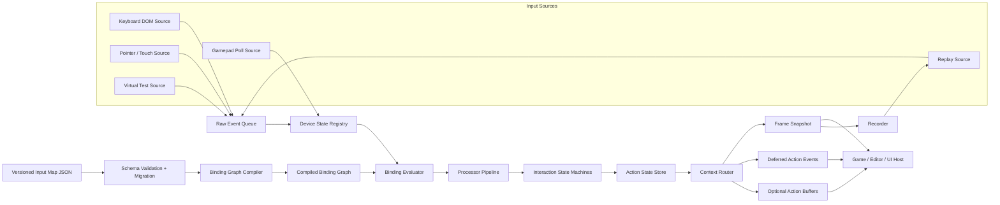

# InputFlow 输入控制系统设计文档

> 文档状态：Proposed / 可进入实现评审
> 版本：0.1
> 日期：2026-06-20
> 产品名：InputFlow（流控）
> 首个宿主项目：Sinan Scene Director

---

## 1. 摘要

InputFlow 是一个面向 Web 游戏、Web 3D 编辑器和交互式应用的**数据优先、框架无关、渲染器无关**输入控制系统。

它不让业务代码直接依赖 `keydown`、`PointerEvent` 或 `navigator.getGamepads()`，而是把不同设备产生的低层输入统一转换为可查询、可路由、可重绑定、可录制回放的语义动作：

```text
设备输入 → 标准化控制值 → Binding → Processor → Interaction
       → Action State → Context Routing → 游戏、编辑器或 UI
```

InputFlow 作为独立项目存在；Sinan 是第一个真实宿主、集成样例和验收场，而不是 InputFlow 的所有者。Sinan 通过薄 adapter、版本化 JSON 和稳定 runtime API 接入，不把 InputFlow 绑定到 React、Three.js 或 Sinan 内部 store。

### 1.1 一句话定义

> InputFlow 是浏览器原始输入与游戏/工具语义之间的确定性动作路由层。

### 1.2 第一版成功标准

第一版完成后，宿主应用应能做到：

- 用同一个 `interact` action 接收 `E`、鼠标主键和手柄 South/A 键。
- 用同一个 `move` action 接收 WASD、方向键和手柄左摇杆。
- 明确分离 editor、viewport tool、gameplay、modal、text editing 等输入上下文。
- 支持 `isPressed`、`justPressed`、`justReleased`、轴值和输入缓冲。
- 从 Git 可追踪 JSON 加载默认映射，并单独保存用户重绑定 override。
- 在不启动真实浏览器设备的情况下，用 Virtual Input 和 Replay 完成确定性测试。
- 在失焦、切换标签页、设备断连等情况下不产生“卡键”。

---

## 2. 背景与约束

Sinan 当前采用数据源优先、schema/validator、runtime adapter 和自动化测试的架构；Three.js 被限制在 runtime 实现层，高频状态不能依赖 React `setState`。InputFlow 必须保持相同的边界纪律：

- 默认映射是可校验、可迁移、可 diff 的数据。
- 高频输入状态属于独立 runtime，不属于 React UI state。
- 核心包不依赖 Three.js、React 或任何具体游戏引擎。
- DOM、Gamepad 和未来 WebXR/WebHID 由 source/adapter 接入。
- 输入行为必须能够通过虚拟设备、时钟注入和回放进行测试。

InputFlow 同时需要解决 Web 特有问题：

- 键盘事件是异步事件流，而 Gamepad 主要按帧采样。
- Pointer 需要覆盖鼠标、触控笔和触屏，并处理 pointer capture、pointer lock、wheel 与坐标空间。
- 编辑器快捷键、文本输入、Viewport 工具与游戏输入可能同时存在。
- 浏览器失焦可能导致 `keyup` 丢失。
- DOM 默认行为不能被全局、无条件地阻止。

---

## 3. 目标与非目标

### 3.1 核心目标

1. **动作语义优先**
   业务读取 `gameplay.move`、`gameplay.interact`，而不是设备按键。

2. **统一多设备**
   支持 Keyboard、Pointer、Touch、Gamepad 和 Virtual/Replay Source。

3. **上下文路由**
   通过优先级、焦点条件和消费规则解决 editor/gameplay/modal 冲突。

4. **确定性帧状态**
   在宿主调用 `update(time)` 后生成稳定快照；边沿状态保持到下一次 update。

5. **数据优先**
   默认 Input Map、Action 和 Binding 可以 JSON 序列化、校验、迁移和版本控制。

6. **可重绑定**
   默认映射与用户 override 分离；更新默认映射时不覆盖用户配置。

7. **可测试、可回放**
   不依赖真实 DOM 事件即可注入设备输入；记录结果可以稳定重放。

8. **低耦合、低开销**
   核心无 DOM、无框架、无渲染器依赖；高频查询不分配临时对象。

### 3.2 第一版非目标

以下内容不进入 v0.1 核心范围：

- 文本输入、IME、候选词和富文本编辑；继续交给原生 DOM 控件。
- 完整手势识别系统，如 pinch、rotate、复杂多指手势。
- WebXR、WebHID、MIDI、运动传感器。
- 网络输入预测、rollback netcode、跨客户端同步。
- 完整本地多人设备配对与玩家账户管理。
- 手柄震动、灯光和高级输出控制。
- 可视化 Input Map 编辑器；第一版先提供 schema、诊断与简单重绑 UI 接口。
- 自己拥有 `requestAnimationFrame` 或固定时间步游戏循环。
- 世界坐标 raycast；InputFlow 只提供屏幕/目标坐标，宿主负责相机与世界变换。

---

## 4. 设计原则

### 4.1 宿主拥有时间和循环

InputFlow 不启动自己的 RAF，也不隐式更新。宿主在合适位置调用：

```ts
input.update(performance.now())
```

推荐顺序：

```text
浏览器事件持续入队
        ↓
宿主开始一帧
        ↓
InputFlow.update(now)
        ↓
游戏 / 编辑器读取 Action Snapshot
        ↓
模拟、相机、Timeline、渲染
```

### 4.2 Pull 为主，Event 为辅

高频游戏逻辑使用快照查询：

```ts
const move = input.readAxis2D('gameplay.move')
const interact = input.readButton('gameplay.interact')
```

事件订阅只用于低频命令、UI 提示和诊断。事件在本次 `update()` 完成后统一派发，禁止在 Binding 计算中重入修改系统。

### 4.3 配置与运行时状态分离

```text
Input Map JSON       = 可保存、可迁移的事实源
Compiled BindingGraph = 运行时派生缓存
Device State          = 瞬时状态
Action Snapshot        = 每帧派生状态
React Component State  = 仅展示需要的低频投影
```

运行时缓存和 React 状态都不是映射事实源。

### 4.4 不使用隐式全局单例

每个宿主、测试、Viewport 或嵌入式实例都可以创建独立的 `InputFlow`。Source 的绑定与销毁必须显式、幂等。

### 4.5 安全的扩展注册表

自定义 Processor、Interaction 和 Source 通过 registry 注册，不允许配置中包含函数源码、`eval` 或脚本字符串。

### 4.6 浏览器行为最小侵入

`preventDefault()` 只对明确匹配、当前激活且配置要求阻止默认行为的 Binding 生效。InputFlow 默认不调用 `stopPropagation()`。

---

## 5. 核心概念

| 概念 | 含义 |
|---|---|
| Device | 一类或一个输入设备，如 Keyboard、Pointer、Gamepad |
| Control | 设备上的最小可读输入，如 `KeyE`、左摇杆、Pointer 主键 |
| Control Path | 稳定描述 Control 的字符串协议 |
| Source | 把浏览器、虚拟设备或回放数据转换成 Raw Input 的适配器 |
| Binding | 将一个或多个 Control 连接到一个 Action |
| Composite | 将多个 Control 合成为一维或二维值，如 WASD |
| Processor | 对值做纯转换，如 deadzone、invert、scale、clamp |
| Interaction | 根据时间与阈值解释操作，如 press、tap、hold、repeat |
| Action | 业务语义输入，如 move、interact、save、orbit |
| Input Map | 一组 Action 和 Binding 的可序列化定义 |
| Context | Input Map 的运行时激活实例，含优先级、焦点和消费策略 |
| Snapshot | 某次 `update()` 后稳定的 Action 状态集合 |
| Override | 用户对默认 Binding 的增量修改 |
| Recorder/Replay | 记录、重放标准化输入或 Action 事件的测试机制 |

---

## 6. 总体架构



### 6.1 双路径模型

InputFlow 有两条相互独立的路径：

**配置路径**

```text
JSON / code config
→ schema 校验
→ migration
→ binding graph compile
→ 只读运行时图
```

**帧运行路径**

```text
DOM event queue + Gamepad sample
→ device state
→ active context binding evaluation
→ processor
→ interaction
→ action snapshot
```

配置变更不会直接污染当前帧。加载新映射或应用 override 时，在安全边界重新编译并原子替换 Binding Graph。

---

## 7. 包与仓库设计

推荐独立 monorepo：

```text
inputflow/
├─ packages/
│  ├─ core/               # 无 DOM、无框架、无运行时依赖
│  ├─ browser/            # Keyboard、Pointer、Touch、Gamepad Source
│  ├─ schema/             # Zod schema、migration、JSON Schema 输出
│  ├─ testing/            # Virtual Source、Fake Clock、Recorder、Replay
│  └─ react/              # 可选低频订阅与诊断 hooks
├─ examples/
│  ├─ playground/
│  └─ rebinding-demo/
├─ docs/
├─ benchmarks/
└─ package.json
```

### 7.1 包职责

#### `@inputflow/core`

- Action、Binding、Context、Snapshot、Processor、Interaction。
- Raw Input 接口与 Source contract。
- Binding Graph Compiler。
- 内置纯 Processor 与 Interaction。
- 不访问 `window`、`document`、`navigator`。
- 不依赖 React、Three.js、Zod。

#### `@inputflow/browser`

- Keyboard DOM Source。
- Pointer Events、wheel、pointer capture、pointer lock 辅助。
- Touch 通过 Pointer Events 统一接入。
- Gamepad 按 `update()` 轮询。
- focus、blur、visibility 和 editable target 策略。
- 可在没有 DOM 的环境安全 import；只有创建 Browser Source 时访问浏览器对象。

#### `@inputflow/schema`

- Input Map 与 Override 的 Zod schema。
- 版本迁移和结构化 validation error。
- JSON Schema 导出，供编辑器、CLI 和 AI agent 使用。
- 保持为可选包，生产 runtime 可以在构建阶段预验证后不携带 Zod。

#### `@inputflow/testing`

- `VirtualInputSource`。
- 可注入单调时钟。
- Raw Event 与 Action Event recorder。
- Replay runner 和快照断言辅助。
- Adapter contract test suite。

#### `@inputflow/react`

- 只提供外部 store 桥接和低频 diagnostics hooks。
- React 为 peer dependency。
- 不让 gameplay 每帧状态进入 React 主渲染树。
- 使用缓存快照，避免每次读取都创建新对象。

### 7.2 Sinan Adapter 的归属

第一阶段 adapter 建议放在 Sinan 仓库：

```text
sinan/src/integrations/inputflow/**
```

原因：Sinan 的 mode、editor command、focus policy 和 runtime 生命周期仍在演化。待接口稳定后，再考虑发布独立的 `@inputflow/sinan`。InputFlow 核心仓库只维护宿主接口契约和 contract tests，不反向依赖 Sinan。

---

## 8. 控制路径协议

Control Path 必须稳定、可读、可序列化，并明确区分物理键位与语义键值。

推荐格式：

```text
<Device>/category/control
```

示例：

```text
<Keyboard>/code/KeyE
<Keyboard>/key/Enter
<Keyboard>/modifier/primary
<Keyboard>/modifier/shift

<Pointer>/button/primary
<Pointer>/button/secondary
<Pointer>/position
<Pointer>/delta
<Pointer>/wheel

<Gamepad>/button/south
<Gamepad>/button/east
<Gamepad>/leftStick
<Gamepad>/rightStick
<Gamepad>/leftTrigger
<Gamepad>/raw/button/7
```

### 8.1 键盘策略

- 游戏移动和位置相关控制默认使用 `KeyboardEvent.code`，表达物理键位。
- 语义快捷键可使用 `KeyboardEvent.key`。
- 提供 `<Keyboard>/modifier/primary`，在 Windows/Linux 映射 Ctrl，在 macOS 映射 Meta。
- 默认忽略浏览器 `keydown.repeat` 对 `justPressed` 的重复触发；需要连续导航时使用 InputFlow 的确定性 `repeat` Interaction。

### 8.2 Gamepad 策略

- 优先使用浏览器 standard mapping 的语义路径。
- 非标准设备允许 raw axis/button 路径作为 fallback。
- 不把浏览器 gamepad index 当作永久设备身份。
- v0.1 默认选择最近活动的可用 Gamepad；多人设备配对延后。

### 8.3 Pointer 与坐标

Pointer Source 至少维护：

- `clientPosition`
- 相对于绑定目标元素的 `targetPosition`
- 归一化 `targetNormalized`，范围 `[0, 1]`
- 本帧累计 `delta`
- buttons、pressure、pointerType、primary pointer 标记

InputFlow 不生成 NDC、ray 或世界坐标；宿主 adapter 负责从目标坐标转换为 Three.js 或其他渲染器使用的坐标。

---

## 9. 可序列化数据模型

### 9.1 Input Map 示例

```json
{
  "schemaVersion": 1,
  "id": "sinan.default",
  "maps": [
    {
      "id": "gameplay",
      "actions": [
        {
          "id": "move",
          "valueType": "axis2d",
          "combine": "maxMagnitude"
        },
        {
          "id": "interact",
          "valueType": "button",
          "bufferMs": 120
        }
      ],
      "bindings": [
        {
          "id": "gameplay.move.wasd",
          "action": "move",
          "source": {
            "kind": "composite2d",
            "up": "<Keyboard>/code/KeyW",
            "down": "<Keyboard>/code/KeyS",
            "left": "<Keyboard>/code/KeyA",
            "right": "<Keyboard>/code/KeyD"
          },
          "processors": [
            { "type": "normalize2d" }
          ]
        },
        {
          "id": "gameplay.move.gamepad",
          "action": "move",
          "source": {
            "kind": "control",
            "path": "<Gamepad>/leftStick"
          },
          "processors": [
            { "type": "radialDeadzone", "min": 0.18, "max": 1 }
          ]
        },
        {
          "id": "gameplay.interact.keyboard",
          "action": "interact",
          "source": {
            "kind": "control",
            "path": "<Keyboard>/code/KeyE"
          }
        },
        {
          "id": "gameplay.interact.pointer",
          "action": "interact",
          "source": {
            "kind": "control",
            "path": "<Pointer>/button/primary"
          }
        },
        {
          "id": "gameplay.interact.gamepad",
          "action": "interact",
          "source": {
            "kind": "control",
            "path": "<Gamepad>/button/south"
          }
        }
      ]
    }
  ]
}
```

### 9.2 用户 Override 示例

默认配置和用户配置必须分离：

```json
{
  "schemaVersion": 1,
  "baseMapId": "sinan.default",
  "profileId": "local-user",
  "bindingOverrides": [
    {
      "bindingId": "gameplay.interact.keyboard",
      "path": "<Keyboard>/code/KeyF"
    }
  ]
}
```

规则：

- Override 通过稳定 `bindingId` 定位，不复制整份默认 map。
- Core 不内置 `localStorage`；宿主提供持久化 adapter。
- 默认 map 升级后，无法定位的 override 产生结构化 warning，不静默应用到错误 Binding。
- schema migration 在载入时完成；保存时写最新版本。

---

## 10. Action 与状态模型

### 10.1 Action 类型

v0.1 支持三类值：

```ts
type ActionValueType = 'button' | 'axis1d' | 'axis2d'
```

后续可增加 `axis3d`、pose 或自定义结构，但不进入第一版公开协议。

### 10.2 Button Snapshot

```ts
interface ButtonActionState {
  readonly value: number
  readonly isPressed: boolean
  readonly justPressed: boolean
  readonly justReleased: boolean
  readonly heldMs: number
  readonly lastChangedAt: number
  readonly sourceControl?: string
}
```

语义：

- `justPressed`：本次 update 中越过按下阈值。
- `justReleased`：本次 update 中越过释放阈值。
- 两者在下一次 `update()` 前保持稳定。
- 模拟量按钮使用独立 press/release threshold，形成 hysteresis，避免临界抖动。

### 10.3 Axis Snapshot

```ts
interface Axis1DActionState {
  readonly value: number
  readonly previousValue: number
  readonly delta: number
  readonly magnitude: number
  readonly changed: boolean
}

interface Axis2DActionState {
  readonly value: Readonly<{ x: number; y: number }>
  readonly previousValue: Readonly<{ x: number; y: number }>
  readonly delta: Readonly<{ x: number; y: number }>
  readonly magnitude: number
  readonly changed: boolean
}
```

公开读取 API 返回稳定只读视图。内部使用复用 buffer，避免每次查询分配新对象。

### 10.4 多 Binding 合并

默认合并规则：

- Button：逻辑 OR，保留最近发生阈值变化的 source。
- Axis：`maxMagnitude`，避免键盘和摇杆相加超过范围。
- 可选 `sumClamp` 和 `latestActuated`。
- 同一 Action 的 combine policy 必须显式且可测试。

---

## 11. Binding、Processor 与 Interaction

### 11.1 内置 Binding Source

v0.1：

- `control`
- `composite1d`
- `composite2d`
- `chord`

`chord` 示例：

```json
{
  "id": "editor.save.primary",
  "action": "save",
  "source": {
    "kind": "chord",
    "primary": "<Keyboard>/code/KeyS",
    "modifiers": ["<Keyboard>/modifier/primary"]
  }
}
```

Sequence、复杂手势和多段 combo 延后。

### 11.2 内置 Processor

Processor 必须是确定性纯函数：

- `deadzone`
- `radialDeadzone`
- `scale`
- `invert`
- `clamp`
- `normalize2d`
- `sensitivity`

时间依赖 smoothing 不作为普通 Processor；如后续加入，必须显式接收 `deltaTime`，并记录在 replay contract 中。

### 11.3 内置 Interaction

v0.1：

- `press`
- `tap`
- `hold`
- `repeat`

`repeat` 由 InputFlow 的时钟驱动，不依赖操作系统键盘重复速率，因此可重放、可跨设备统一。

### 11.4 扩展注册

```ts
input.registry.registerProcessor('curve', curveProcessorFactory)
input.registry.registerInteraction('doubleTap', doubleTapFactory)
```

要求：

- 注册名称必须唯一。
- schema 只允许已注册类型。
- 未知扩展在严格模式下阻止编译，在宽松生产模式下禁用对应 Binding 并报告诊断。
- 配置只存参数，不存可执行代码。

---

## 12. Context 路由模型

Input Map 是静态配置；Context 是动态激活和路由单位。

```ts
interface InputContextOptions {
  id: string
  maps: readonly string[]
  priority: number
  routing: 'shared' | 'consumeMatched' | 'exclusive'
  focus: 'global' | 'canvas' | 'editable' | string
  allowWhenEditing?: boolean
}
```

推荐通过 lease 管理生命周期：

```ts
const gameplayContext = input.activateContext({
  id: 'sinan.runtime.gameplay',
  maps: ['gameplay'],
  priority: 400,
  routing: 'consumeMatched',
  focus: 'canvas'
})

// 模式结束
gameplayContext.dispose()
```

### 12.1 路由规则

1. 仅评估已激活、焦点条件满足的 Context。
2. 按 priority 从高到低计算。
3. `shared` 不阻止低优先级 Context。
4. `consumeMatched` 只消费实际匹配并产生有效值的 Control。
5. `exclusive` 在 Context 激活时阻止更低 Context 接收任何输入。
6. 同一 Context 内多个 Action 可以共享一个 Control；冲突由诊断器报告，但不默认禁止。
7. Context 消费属于路由层，不等同于 DOM `preventDefault()`。

### 12.2 Sinan 推荐优先级

```text
1000  editor.modal
 900  editor.textEditing
 750  editor.gizmo
 650  editor.viewportTool
 400  runtime.gameplay
 200  editor.globalCommands
 100  diagnostics
```

实际优先级常量应集中定义，不散落 magic number。

### 12.3 Editable Target 策略

Browser Source 对 `input`、`textarea`、`select` 和 `contenteditable` 默认分类为 editable：

- 普通 gameplay 与 viewport shortcut 默认不接收。
- 显式 `allowWhenEditing` 的 Context 可以接收，例如 Escape、保存命令。
- 文本内容本身不进入 InputFlow recorder。

---

## 13. Source 接口与帧处理

### 13.1 Core Source Contract

```ts
interface InputSource {
  readonly id: string
  connect(sink: RawInputSink): Disposable
  sample?(timeMs: number, sink: RawInputSink): void
  reset?(reason: InputResetReason, sink: RawInputSink): void
}
```

- 事件型 Source 在事件到达时写入 queue。
- 轮询型 Source 在 `sample()` 中写入最新值。
- Core 在同一次 `update()` 中统一排序和处理。

### 13.2 Raw Event

```ts
interface RawInputEvent {
  readonly sourceId: string
  readonly deviceId: string
  readonly control: string
  readonly value: number | Readonly<{ x: number; y: number }>
  readonly timeMs: number
  readonly sequence: number
}
```

时间戳必须被规范化为同一单调时钟域。相同时间戳使用 sequence 保持确定顺序。

### 13.3 `update()` 步骤

```text
1. 旋转 previous/current action buffer
2. 调用轮询 Source.sample(now)
3. 读取并稳定排序 Raw Event Queue
4. 更新 Device State
5. 清理上一帧瞬时值，如 pointer delta、wheel delta
6. 评估激活 Context 与受影响 Binding
7. 执行 Processor 和 Interaction
8. 合并 Action 值
9. 路由、消费和生成 Action Snapshot
10. 写入 Action Buffer / Recorder
11. 在计算完成后派发订阅事件
```

实现时第 5 步应在应用本帧新事件之前完成，保证 delta 是“自上次 update 起的累计量”。

### 13.4 固定时间步与输入缓冲

`justPressed` 是 render/update frame 语义。对固定模拟和动作游戏，使用显式 Action Buffer：

```ts
if (input.buffers.take('gameplay.jump', simulationTime)) {
  character.tryJump()
}
```

- `bufferMs` 在 Action 定义中配置。
- Buffer 保存带时间戳、序列号的 performed event。
- `take()` 消费一次，不影响 Snapshot 广播语义。
- 第一版不自动把墙钟输入重采样到网络 tick；宿主可以在 Replay/Simulation Adapter 中定义 tick 映射。

---

## 14. Browser Source 设计

### 14.1 Keyboard

- 监听 `keydown`、`keyup`。
- 同时保留 `code` 与 `key`，Binding 明确选择一种语义。
- `event.repeat` 不重复产生 press edge。
- `blur`、`visibilitychange`、source detach 时合成 release/reset，消除卡键。
- modifier 状态由实际事件和 reset 共同维护。

### 14.2 Pointer 与 Touch

- 以 Pointer Events 为统一基础，支持 mouse、pen、touch。
- wheel 独立采集并按帧累计。
- 多 pointer 原始状态保留；v0.1 Action Binding 默认面向 primary pointer。
- 提供显式 pointer capture 辅助，不自动 capture。
- 提供显式 pointer lock 请求与释放 API；调用仍由用户手势触发的宿主代码发起。
- 可选读取 coalesced events 用于高频画笔/瞄准，但不作为 v0.1 正确性依赖。

### 14.3 Gamepad

- 每次 `update()` 调用 `navigator.getGamepads()` 采样。
- 按 buttons `[0,1]` 和 axes `[-1,1]` 标准化。
- 对 standard mapping 提供语义 Control。
- 内置 deadzone 与按键阈值滞回。
- 处理 connect、disconnect 和 index 复用。
- 自动选择最近活动设备只是一种 v0.1 policy，内部结构不得阻止未来玩家配对。

### 14.4 Virtual Source

Virtual Source 是第一等能力，不是测试补丁：

```ts
virtual.setButton('<Keyboard>/code/KeyE', true, 1000)
input.update(1000)
virtual.setButton('<Keyboard>/code/KeyE', false, 1016)
input.update(1016)
```

同一接口可用于：

- 单元测试。
- AI agent 自动验证。
- 屏幕虚拟摇杆和可访问性辅助输入。
- 自动演示与 tutorial playback。

---

## 15. 公共 API 草案

### 15.1 创建与连接

```ts
import { createInputFlow } from '@inputflow/core'
import { createBrowserSource } from '@inputflow/browser'
import { inputMapSchema } from '@inputflow/schema'

const map = inputMapSchema.parse(rawInputMapJson)

const input = createInputFlow({
  maps: [map],
  strict: import.meta.env.DEV
})

const browser = createBrowserSource({
  keyboardTarget: window,
  pointerTarget: canvas,
  gamepad: true
})

input.addSource(browser)
```

### 15.2 激活 Context

```ts
const gameplay = input.activateContext({
  id: 'runtime.gameplay',
  maps: ['gameplay'],
  priority: 400,
  routing: 'consumeMatched',
  focus: 'canvas'
})
```

### 15.3 帧读取

```ts
function frame(now: number) {
  input.update(now)

  const move = input.readAxis2D('gameplay.move')
  const interact = input.readButton('gameplay.interact')

  player.move(move.value)

  if (interact.justPressed) {
    interactionSystem.tryInteract()
  }

  requestAnimationFrame(frame)
}
```

### 15.4 低频订阅

```ts
const unsubscribe = input.onAction(
  'editor.save',
  'performed',
  event => commandBus.execute('save')
)
```

订阅回调在 Action 计算结束后执行。回调中启停 Context 的修改在下一个安全点生效。

### 15.5 重绑定

```ts
const result = await browser.beginRebind({
  actionId: 'gameplay.interact',
  bindingId: 'gameplay.interact.keyboard',
  expectedControl: 'button',
  exclude: [
    '<Keyboard>/key/Escape'
  ],
  signal: abortController.signal
})

input.overrides.apply({
  bindingId: result.bindingId,
  path: result.controlPath
})
```

重绑定 session 必须支持 cancel、timeout、冲突报告和恢复原值。是否允许冲突由宿主策略决定。

### 15.6 销毁

```ts
gameplay.dispose()
input.dispose()
```

`dispose()` 必须幂等，移除所有 listener、释放 pointer 状态并让所有当前按下 Control 归零。

---

## 16. React Adapter

React 不是 InputFlow 的主循环。React adapter 只服务：

- 重绑定界面。
- 当前设备提示。
- Input Debug Panel。
- 显示当前 action 值或冲突诊断。
- 可访问性和设置页。

推荐接口：

```ts
const interact = useInputAction(input, 'gameplay.interact', {
  frequency: 'changesOnly'
})
```

内部使用外部 store 订阅模型。`getSnapshot()` 必须缓存，只有数据实际变化时才返回新快照。Gameplay、camera、gizmo 和 timeline sampling 仍直接访问 Core。

---

## 17. 录制、回放与确定性

### 17.1 两种记录层级

1. **Raw Recording**
   记录标准化 Control Event，可测试 Binding、Processor、Interaction 和 Context。

2. **Action Recording**
   记录路由后的 Action Event，可用于游戏逻辑、教程和更稳定的跨设备回放。

### 17.2 记录格式

```json
{
  "schemaVersion": 1,
  "kind": "raw",
  "clock": "relative-ms",
  "events": [
    {
      "t": 0,
      "control": "<Keyboard>/code/KeyE",
      "value": 1
    },
    {
      "t": 42,
      "control": "<Keyboard>/code/KeyE",
      "value": 0
    }
  ]
}
```

### 17.3 确定性边界

- Replay 使用注入时钟，不读取真实 `performance.now()`。
- Processor 与 Interaction 不得读取全局时间或随机数。
- Context 激活/停用也应作为回放事件记录，或由宿主在相同时点确定性执行。
- DOM 坐标相关 Replay 应记录标准化目标坐标，而非依赖重放时的页面布局。
- 默认不记录文本内容、原始按键字符序列或长期设备标识。

---

## 18. 诊断与错误模型

### 18.1 结构化错误

建议错误类型：

```ts
interface InputDiagnostic {
  severity: 'error' | 'warning' | 'info'
  code:
    | 'DUPLICATE_ID'
    | 'UNKNOWN_CONTROL'
    | 'UNKNOWN_PROCESSOR'
    | 'UNKNOWN_INTERACTION'
    | 'UNRESOLVED_ACTION'
    | 'INVALID_OVERRIDE'
    | 'BINDING_CONFLICT'
    | 'UNSUPPORTED_DEVICE'
  message: string
  path?: readonly (string | number)[]
  mapId?: string
  bindingId?: string
}
```

### 18.2 Debug Snapshot

调试接口可输出：

- 已连接 Source 与 Device。
- 当前激活 Context 栈。
- 当前按下 Control。
- Action 当前值与来源 Binding。
- 被高优先级 Context 消费的输入。
- 未解析 override 和冲突。
- 最近若干 Raw/Action Event 环形缓冲。

默认不 `console.log`，由宿主决定展示或采集。

---

## 19. 性能设计

### 19.1 热路径原则

- Binding Graph 在配置变更时编译，不在每帧解析字符串。
- Control Path 编译为内部整数 ID。
- 建立 `controlId → affectedBindingIds` 反向索引，只重算受影响 Binding。
- Gamepad 轮询只处理已连接设备和已被引用的 Control。
- Action State 使用双缓冲或固定对象复用。
- 查询 API 不创建闭包、数组和临时向量。
- 事件订阅批量、延迟派发，避免热路径重入。

### 19.2 初始性能预算

以下是工程目标，不是发布前承诺：

- `@inputflow/core`：目标不超过 15 KB min+gzip。
- `@inputflow/browser`：相对 core 增量目标不超过 10 KB min+gzip。
- 默认配置下，100 个 Action、300 个 Binding 的桌面帧更新应明显低于 1 ms。
- 无输入变化时，只执行必要轮询和计时 Interaction。
- CI 增加 bundle size 和基准回归检查。

实际预算应在第一个 benchmark fixture 完成后调整。

---

## 20. 技术栈

| 领域 | 选择 | 说明 |
|---|---|---|
| 语言 | TypeScript，strict mode | 公共 API、schema 类型和 adapter contract 全部类型化 |
| 模块 | ESM-first | 面向现代 Web 工具链；`exports` 显式声明子路径 |
| 运行目标 | ES2022 + feature detection | Core 不依赖 DOM；Browser 包单独包含 DOM lib |
| Monorepo | npm workspaces | 与 Sinan 的 npm 工作流一致，降低接入摩擦 |
| 类型构建 | `tsc -b` + Project References | 强制包边界，生成 declaration 与 declaration map |
| Library Build | Vite Library Mode | 生成可 tree-shake 的浏览器库；外部化 peer dependency |
| Schema | Zod，独立 schema 包 | 与 Sinan 对齐；运行时可选择不携带 schema 包 |
| 单元测试 | Vitest | Core、compiler、processor、interaction、migration 测试 |
| 原生浏览器测试 | Vitest Browser Mode + Playwright provider | 在真实浏览器上下文测试 DOM Source |
| E2E / Smoke | Playwright | Chromium、Firefox、WebKit；同时验证 Sinan Gate Demo |
| React 集成 | React peer dependency + `useSyncExternalStore` | 仅桥接外部 runtime store，不承载帧循环 |
| 代码质量 | ESLint + Prettier | 与现有项目命令结构保持一致 |
| 发布 | Changesets + npm | 独立包版本、changelog 和预发布流程 |
| CI | GitHub Actions | typecheck、lint、unit、browser、build、size、smoke |
| 文档 | Markdown + TypeDoc | Git-friendly 设计文档与 API 文档 |

### 20.1 运行时依赖策略

- `core`：零运行时依赖。
- `browser`：仅依赖 `core`。
- `testing`：仅依赖 `core`。
- `schema`：依赖 Zod。
- `react`：依赖 `core`，React 为 peer dependency。
- 不引入 RxJS、Redux、Zustand 或通用 EventEmitter 包；核心使用小型 typed signal 实现。

### 20.2 发布产物

每个包至少输出：

```text
dist/index.js
 dist/index.d.ts
 dist/index.d.ts.map
 package.json exports
```

`package.json`：

- `type: module`
- `sideEffects: false`
- 显式 `exports`
- 不导出内部路径
- source map 与 declaration map 可用

---

## 21. 测试策略

### 21.1 Core Unit Tests

必须覆盖：

- press/release edge。
- 同一帧多次按下/释放。
- key repeat 不重复 press。
- hysteresis、deadzone 和 axis combine。
- composite1d/composite2d/chord。
- tap、hold、repeat 的边界时间。
- Context priority、shared、consumeMatched、exclusive。
- action buffer 过期与单次消费。
- override 应用、失效与 migration。
- Source reset、blur、disconnect 后无卡键。
- 相同录制在相同配置下产生相同快照序列。

### 21.2 Browser Integration Tests

- Keyboard `code` 与 `key`。
- editable target 过滤。
- Pointer button、move、wheel、pointerType。
- pointer capture 生命周期。
- visibility/blur reset。
- 多个目标元素与多个 InputFlow 实例互不污染。
- `preventDefault` 只对命中 Binding 生效。

### 21.3 Gamepad Tests

CI 主要使用模拟/Virtual Gamepad Source 测试标准映射、deadzone、断连和 index 复用；真实硬件测试作为发布 checklist，不将不稳定的物理设备作为自动化 CI 硬依赖。

### 21.4 Cross-browser Matrix

- Chromium
- Firefox
- WebKit
- 至少一个移动 viewport / touch 仿真 smoke

### 21.5 Sinan Contract Test

Gate Demo 最小验收：

1. `E` 或 Pointer Primary 触发 `runtime.gameplay.interact`。
2. 编辑器 Viewport 激活时，选择输入不会泄漏到 gameplay。
3. Modal 打开后消费对应输入，关闭后 gameplay 恢复。
4. 文本字段聚焦时，普通 gameplay shortcut 不触发。
5. 重绑定后保存 override，刷新后仍生效。
6. Virtual Replay 可以无人工操作完成一次 Gate interaction smoke。

---

## 22. Sinan 集成设计

### 22.1 数据位置

建议：

```text
data/inputMaps/default.json
 data/inputMaps/editor.json
 data/inputProfiles/*.json        # 仅在项目需要共享 profile 时
```

用户本地 override 是否进入 Git 由 Sinan 项目策略决定；InputFlow Core 不决定存储位置。

### 22.2 运行时边界

```mermaid
flowchart LR
  JSON[data/inputMaps/*.json] --> SCH[Sinan Schema Loader]
  SCH --> IFC[@inputflow/schema]
  IFC --> CORE[@inputflow/core]
  DOM[Browser APIs] --> BR[@inputflow/browser]
  BR --> CORE
  CORE --> LOOP[Sinan Runtime Loop]
  CORE --> AD[Sinan Input Adapter]
  AD --> EVT[Event / Interaction System]
  AD --> VP[Editor Viewport Tools]
  CORE --> REACT[@inputflow/react diagnostics]
```

硬性边界：

- InputFlow 不 import Three.js。
- InputFlow 不 import Sinan editor store。
- Sinan game loop 每帧调用 Core，并直接读取高频 action。
- React 面板只通过 diagnostics/react adapter 订阅低频投影。
- Picking 和 world ray 由 Sinan runtime 将 Pointer target coordinate 转换后执行。
- Sinan mode 切换通过 Context lease，不直接开关 DOM listener。

### 22.3 第一阶段 Input Map

建议先实现：

```text
runtime.gameplay
  interact
  cancel
  move（即使 Gate Demo 暂不需要，也用于验证 axis）

editor.global
  save
  undo
  redo

editor.viewport
  select
  orbit
  pan
  dolly
  focusSelection

editor.modal
  confirm
  cancel
```

POC 只接通 `interact`、`select` 和 modal 隔离；其余 Action 可以先建立 schema fixture，不一次性迁移所有快捷键。

---

## 23. 实现阶段

### Phase 0：契约与仓库基线

- 建立独立仓库与 workspace。
- 确定公开术语、Control Path、Action State 和 Source contract。
- 建立 ADR、lint、typecheck、build、unit test、package exports。
- 用 Virtual Source 完成最小 button action 纵向切片。

### Phase 1：Core MVP

- Device State、Raw Event Queue、Binding Compiler。
- button、axis1d、axis2d。
- control、composite1d、composite2d、chord。
- Processor、press/hold/tap/repeat。
- Context priority 与消费。
- Snapshot、Action Buffer、diagnostics。

### Phase 2：Browser 与 Schema

- Keyboard、Pointer、wheel、focus reset。
- Gamepad poll 与 standard mapping。
- Zod schema、migration、override。
- Rebind session。
- Browser Mode 测试。

### Phase 3：Testing 与 Replay

- Virtual Source、Fake Clock。
- Raw/Action Recorder。
- Deterministic Replay。
- Adapter contract test suite。
- 性能 fixture 与 bundle budget。

### Phase 4：Sinan Gate Demo POC

- `data/inputMaps/*.json`。
- gameplay/editor/modal Context。
- `interact` 的 E、Pointer、Gamepad Binding。
- React debug panel 的低频诊断。
- Vitest + Playwright smoke。

### Phase 5：产品化

- React 重绑定组件样例。
- 文档站与 playground。
- 版本迁移政策、semver、changeset。
- 稳定后评估 `@inputflow/sinan` 和其他宿主 adapter。

---

## 24. v0.1 Definition of Done

以下条件全部满足，才视为 v0.1 可发布：

- Core 无 DOM、React、Three.js 依赖。
- Browser Source 可独立 attach/detach，失焦后无卡键。
- Keyboard、Pointer、Gamepad、Virtual Source 可用。
- button、axis1d、axis2d、四种基础 Binding 可用。
- Context priority、focus 与 consumption 有完整测试。
- 默认 map 和 override 有 schema、migration 与结构化错误。
- `justPressed`、`justReleased`、hold、tap、repeat 和 action buffer 语义固定。
- 相同 Replay 产生相同 Action Snapshot 序列。
- Chromium、Firefox、WebKit browser tests 通过。
- Sinan Gate Demo 可通过 E、Pointer 和 Virtual Replay 完成 interact。
- React 仅用于诊断/设置，不进入 gameplay 热路径。
- API 文档、最小示例、包 exports 和 bundle size 检查完整。

---

## 25. 关键决策记录

| 决策 | 选择 | 原因 |
|---|---|---|
| 项目归属 | 独立仓库，Sinan 为首个宿主 | 保持跨宿主价值，同时用真实项目约束设计 |
| 核心模型 | Action + Context，而非直接 DOM 查询 | 支持多设备、重绑和输入冲突治理 |
| 输入采集 | DOM 事件入队 + Gamepad 按帧轮询 | 符合浏览器不同 API 的原生模型 |
| 帧所有权 | 宿主显式调用 update | 可接入游戏循环、编辑器和确定性测试 |
| 状态读取 | Snapshot pull 为主 | 热路径简单、明确、低分配 |
| UI 集成 | 外部 store bridge | 避免 React 充当高频输入主存储 |
| 配置 | JSON + schema + compile | Git-friendly、AI-friendly、运行时高效 |
| 扩展 | Registry，不允许脚本字符串 | 可扩展且可校验、可审计 |
| 重绑定存储 | 增量 Override | 默认配置演进时保留用户设置 |
| Gamepad v0.1 | 最近活动设备，暂不做完整玩家配对 | 控制范围，同时保留未来扩展结构 |
| 打包 | ESM-first、多包发布 | 面向现代 Web，避免核心携带可选依赖 |

---

## 26. 待评审问题与建议结论

### 26.1 v0.1 是否支持本地多人？

**建议：不支持完整玩家配对。** 内部保留 `deviceId` 和 selector 接口，公开 API 先提供默认 active Gamepad policy。

### 26.2 是否支持复杂手势？

**建议：不进入 Core v0.1。** 先统一 Pointer；虚拟摇杆和手势作为独立 Source/Interaction 扩展。

### 26.3 是否把 Input Map Context 一起序列化？

**建议：只序列化 Map 和默认 policy，Context 实例仍由宿主模式系统控制。** Modal、Viewport 和 gameplay 的激活时机是应用状态，不应被静态 map 隐式接管。

### 26.4 是否把 Zod 放入 Core？

**建议：不放。** Schema 独立包，开发/编辑阶段强校验，生产可使用预验证产物。

### 26.5 是否发布 `@inputflow/*` scope？

**建议：先视为逻辑包名。** 对外发布前完成 npm scope、商标和域名检查，并优先使用团队拥有的 npm scope。当前网络上已有与 Webflow 表单相关的同名 Inputflow 产品，品牌对外传播需要进一步排查，但不影响内部项目代号和架构设计。

### 26.6 开源协议

**建议：MIT 作为默认候选。** 若后续希望对专利授权做更明确保护，可评估 Apache-2.0；在首次公开发布前确定。

---

## 27. 参考依据

本设计基于以下项目约束与平台规范形成：

- `project-collaboration-brief.md`：Sinan Scene Director 数据优先、runtime-neutral、React 高频状态边界及输入合作要求。
- W3C Pointer Events Level 3：统一 mouse、pen、touch 的 Pointer 模型。
- W3C Gamepad specification：Gamepad buttons、axes 和 standard mapping 的低层模型。
- W3C UI Events `KeyboardEvent.code` / `key`：物理键位与语义键值的区分。
- TypeScript Project References：多包边界与 declaration build。
- Vite Library Mode：浏览器库构建。
- Vitest Browser Mode 与 Playwright：真实浏览器测试。
- React `useSyncExternalStore`：React 与外部 Input runtime 的低频订阅桥接。

---

## 28. 最终建议

InputFlow 的第一版不应追求“覆盖所有设备和所有交互”，而应优先把五个基础契约做稳定：

```text
Control Path
Action State
Context Routing
Frame Timing
Serializable Mapping + Replay
```

这五个契约一旦稳定，Gamepad、移动触控、重绑定 UI、Sinan 编辑器集成和未来其他引擎 adapter 都可以在其上自然演进。反之，如果第一版直接围绕 DOM listener 或 Sinan 内部 store 实现，即使短期更快，也会失去 InputFlow 作为独立 Web 游戏基础设施的长期价值。
