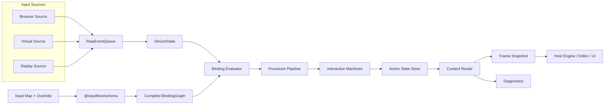

# InputFlow 技术与架构设计 v0.1

> 日期：2026-06-20
> 状态：Implementation architecture draft
> 基于共识：InputFlow 保持宿主无关，Sinan Engine 作为 first-party design partner 提供真实验收场。

---

## 1. 架构定位

InputFlow 是面向 Web 游戏、Web 3D 编辑器和交互式应用的输入 backend/runtime library。它负责把浏览器、手柄、虚拟输入和 replay 输入转换成确定性的 action snapshot。宿主负责 action 语义、context 含义、World/Event/UI/Camera 后果。

核心边界：

```txt
Host owns input semantics.
InputFlow owns deterministic input mechanics.
```

InputFlow 可以处理任意宿主传入的 action id 和 context id，但不解释它们的业务含义。

InputFlow 不做：

- 不定义 Sinan action namespace。
- 不定义 Sinan EngineMode。
- 不调用宿主 EventSystem。
- 不修改 World transform。
- 不操作 Three.Camera。
- 不读取 React store、editor store 或 localStorage。
- 不在 core 中访问 `window`、`document`、`navigator`。

---

## 2. 总体数据流



帧边界由宿主拥有。Source 可以在事件到达时入队，但业务可见状态只在 `update(now)` 后推进。

---

## 3. 包结构

v0.1 首批只建立四个包：

```txt
packages/
  core/
  schema/
  testing/
  browser/
```

后置包：

```txt
packages/react/      # diagnostics 和设置 UI，v0.1 后置
packages/sinan/      # 不在第一阶段创建，先放 Sinan repo 内
```

### 3.1 `@inputflow/core`

职责：

- opaque `ActionId`、`ContextId`、`ControlPath`。
- raw input event queue。
- device state。
- binding graph compile/runtime representation。
- action state 和 snapshot。
- context lease routing。
- processor / interaction registry。
- diagnostics。

依赖策略：

- 零运行时依赖优先。
- 不依赖 DOM、React、Three、Zod、Sinan。
- 可在 Node/Vitest 环境中运行全部核心测试。

### 3.2 `@inputflow/schema`

职责：

- generic InputFlow map schema。
- override schema。
- replay trace schema。
- migration hooks。
- structured validation diagnostics。

依赖策略：

- 可以依赖 Zod 或后续选定 schema 库。
- 只在 load-time / authoring-time 使用。
- 不进入 frame hot path。

### 3.3 `@inputflow/testing`

职责：

- `VirtualInputSource`。
- fake/injected clock。
- replay runner。
- action snapshot trace assertion。
- adapter contract test helpers。

依赖策略：

- 依赖 `@inputflow/core`。
- 不依赖 DOM。
- 不依赖浏览器真实设备。

### 3.4 `@inputflow/browser`

职责：

- Keyboard DOM source。
- Pointer / touch source。
- wheel source。
- basic Gamepad source。
- blur / visibility reset。
- editable target filter。
- attach / detach lifecycle。

依赖策略：

- 依赖 `@inputflow/core`。
- 可安全 import 于无 DOM 环境。
- 只有创建和 attach browser source 时访问浏览器对象。

---

## 4. Core 模块设计

建议首版源码边界：

```txt
packages/core/src/
  ids.ts
  control-path.ts
  raw-event.ts
  raw-event-queue.ts
  device-state.ts
  input-map.ts
  binding-graph.ts
  binding-evaluator.ts
  processors/
  interactions/
  action-state.ts
  context-router.ts
  diagnostics.ts
  input-flow.ts
  source.ts
  snapshot.ts
```

### 4.1 ID 和 Control Path

`ActionId` 和 `ContextId` 是 branded string，只提供轻量类型约束：

```ts
export type ActionId = string & { readonly __brand?: 'ActionId' }
export type ContextId = string & { readonly __brand?: 'ContextId' }
```

`ControlPath` 是稳定字符串协议：

```txt
<Keyboard>/code/KeyE
<Pointer>/button/primary
<Gamepad>/button/south
```

运行时可以将 `ControlPath` intern 为数字 id，但公开 API 保持可读字符串。

### 4.2 Raw Event Queue

`RawInputEvent` 是 Source 到 core 的唯一输入事实：

```ts
interface RawInputEvent {
  readonly sourceId: string
  readonly deviceId: string
  readonly control: string
  readonly value: number | Readonly<{ x: number; y: number }>
  readonly timeMs: number
  readonly sequence: number
}
```

队列要求：

- 事件按 `timeMs`、`sequence` 稳定排序。
- 同一 update 内处理顺序确定。
- Source 不直接修改 action state。

### 4.3 Device State

`DeviceState` 维护 control 当前值和上一帧值。它不理解 action，也不理解宿主语义。

需要覆盖：

- button/control scalar。
- axis1d。
- axis2d。
- pointer position / delta / wheel。
- source reset 合成 release。

### 4.4 Binding Graph

BindingGraph 是 map 和 override 编译后的只读运行时结构。

核心目标：

- frame time 不解析 JSON。
- frame time 不做字符串全表扫描。
- 建立 `controlId -> bindingIds` 反向索引。
- binding compile diagnostics 可机器读取。

v0.1 binding source：

- `control`
- `composite1d`
- `composite2d`
- `chord`

### 4.5 Processor 和 Interaction

Processor 是纯值转换，不能读取全局时间或随机数。

v0.1 processor：

- `deadzone`
- `radialDeadzone`
- `normalize2d`
- `scale`
- `invert`
- `clamp`

Interaction 解释时间和阈值，但只能使用注入的 frame time。

v0.1 interaction：

- `press`
- `tap`
- `hold`
- `repeat`

### 4.6 Action State

v0.1 支持：

```ts
type ActionValueType = 'button' | 'axis1d' | 'axis2d'
```

Button state：

```ts
interface ButtonActionState {
  readonly value: number
  readonly isPressed: boolean
  readonly justPressed: boolean
  readonly justReleased: boolean
  readonly heldMs: number
  readonly lastChangedAt: number
  readonly sourceControl?: string
}
```

要求：

- `justPressed` 和 `justReleased` 只在 frame 边界推进。
- 同一 replay 多次运行得到相同 action trace。
- 查询 API 尽量返回稳定只读对象，避免热路径分配。

### 4.7 Context Lease Router

Context 是 runtime routing primitive，不是宿主 mode。

```ts
interface InputContextOptions {
  readonly id: ContextId
  readonly owner?: string
  readonly priority: number
  readonly routing: 'shared' | 'consumeMatched' | 'exclusive'
  readonly focus?: string
  readonly maps?: readonly string[]
}

interface ContextLease {
  readonly id: string
  readonly contextId: ContextId
  dispose(): void
}
```

规则：

- lease 激活和释放必须幂等。
- 多个 lease 可以共存，按 priority 路由。
- `consumeMatched` 只消费实际产生有效值的 control。
- `exclusive` 阻止低优先级 context。
- debug snapshot 必须能显示 active context stack、owner 和 consumed controls。

### 4.8 Diagnostics

诊断是 core 的正式输出，不是临时 console。

v0.1 诊断类型：

- `DUPLICATE_ID`
- `UNKNOWN_CONTROL`
- `UNKNOWN_PROCESSOR`
- `UNKNOWN_INTERACTION`
- `UNRESOLVED_ACTION`
- `INVALID_OVERRIDE`
- `BINDING_CONFLICT`
- `UNSUPPORTED_DEVICE`
- `CONTEXT_LEASE_LEAK`

诊断应包含 severity、code、message、path、mapId、bindingId、contextId 等结构化字段。

---

## 5. Runtime API 草案

```ts
import { createInputFlow } from '@inputflow/core'

const input = createInputFlow({
  maps,
  strict: true
})

input.addSource(source)

const gameplay = input.activateContext({
  id: 'runtimeGameplay' as ContextId,
  owner: 'host-runtime',
  priority: 400,
  routing: 'consumeMatched',
  focus: 'canvas'
})

input.update(now)

const interact = input.readButton('runtime.gameplay.interact' as ActionId)

gameplay.dispose()
input.dispose()
```

`update(now)` 的内部顺序：

1. rotate previous/current buffers。
2. sample polling sources。
3. drain and sort raw events。
4. update device state。
5. clear per-frame deltas。
6. evaluate active context bindings。
7. run processors and interactions。
8. merge action values。
9. route and consume controls。
10. write snapshot, buffers, diagnostics。
11. dispatch deferred events。

---

## 6. 配置模型

InputFlow 通用 map 不拥有宿主语义，只保存 id 和绑定关系：

```json
{
  "schemaVersion": 1,
  "id": "default",
  "actions": [
    {
      "id": "runtime.gameplay.interact",
      "valueType": "button"
    }
  ],
  "bindings": [
    {
      "id": "interact.keyboard",
      "action": "runtime.gameplay.interact",
      "source": {
        "kind": "control",
        "path": "<Keyboard>/code/KeyE"
      },
      "interactions": [
        { "type": "press" }
      ]
    }
  ]
}
```

宿主可以拥有自己的项目级 schema，再转换为 InputFlow generic map。Sinan 就属于这种模式。

Override 只保存增量：

```json
{
  "schemaVersion": 1,
  "baseMapId": "default",
  "profileId": "local-user",
  "bindingOverrides": [
    {
      "bindingId": "interact.keyboard",
      "path": "<Keyboard>/code/KeyF"
    }
  ]
}
```

---

## 7. Replay 架构

Replay 是 v0.1 一等能力，不是后置测试辅助。

最小 raw control trace：

```json
{
  "schemaVersion": 1,
  "kind": "raw-control-trace",
  "clock": "relative-ms",
  "events": [
    { "t": 0, "type": "context.activate", "contextId": "runtimeGameplay" },
    { "t": 16, "type": "control", "control": "<Keyboard>/code/KeyE", "value": 1 },
    { "t": 32, "type": "control", "control": "<Keyboard>/code/KeyE", "value": 0 },
    { "t": 48, "type": "context.deactivate", "contextId": "runtimeGameplay" }
  ]
}
```

Replay runner 输出 action snapshot trace：

```json
{
  "schemaVersion": 1,
  "kind": "action-snapshot-trace",
  "frames": [
    {
      "t": 16,
      "actions": {
        "runtime.gameplay.interact": {
          "isPressed": true,
          "justPressed": true
        }
      }
    }
  ]
}
```

验收要求：

- 不依赖 DOM。
- 不读取真实 `performance.now()`。
- 能记录或重建 context lifecycle。
- 同一 map + trace 结果稳定。

---

## 8. Browser Source 架构

Browser Source 只负责把浏览器输入标准化为 raw event。

Keyboard：

- 监听 `keydown` / `keyup`。
- 同时支持 `code` 和 `key` path。
- 忽略 `keydown.repeat` 对 press edge 的重复触发。
- blur / visibility / detach 时合成 reset。

Pointer：

- 使用 Pointer Events。
- 输出 button、position、normalized target position、delta、wheel。
- 不输出 ray、NDC、entity hit。
- 不自动 pointer capture。

Editable filter：

- `input`、`textarea`、`select`、`contenteditable` 默认视为 editable。
- gameplay context 默认不接收 editable target 输入。
- 允许宿主通过 focus tag 或 context option 处理 Escape / save 等例外。

Gamepad：

- v0.1 只做 basic South button 和 basic axes。
- 不做完整玩家配对。
- 不把 browser gamepad index 当作长期身份。

---

## 9. 测试架构

测试优先级：

1. core deterministic unit tests。
2. context lease routing tests。
3. replay trace tests。
4. schema and override tests。
5. browser source integration tests。
6. Sinan adapter contract tests。

第一条纵切必须无 DOM：

```txt
VirtualInputSource
  -> RawEventQueue
  -> DeviceState
  -> BindingGraph
  -> press interaction
  -> ButtonActionState
  -> Snapshot
```

关键断言：

- press/release edge 稳定。
- lease dispose 后输入恢复。
- modal context 屏蔽 gameplay context。
- blur reset 不产生卡键。
- replay trace 稳定。
- core dependency boundary 没有 DOM / React / Three / Sinan。

---

## 10. 架构决策待落地

需要用 ADR 固化：

1. package manager：默认建议 `pnpm workspace`，若改用 npm 需明确原因。
2. host semantics boundary：ActionId / ContextId opaque，宿主拥有语义。
3. replay first-class contract：Replay 进入 v0.1 主路径。
4. context lease lifecycle：Context 通过 lease 激活，不使用隐式全局 mode。
5. schema hot-path boundary：schema 只在加载和迁移阶段运行。
